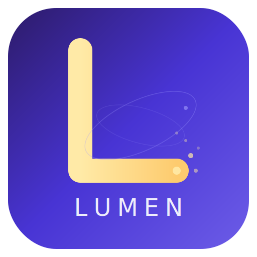
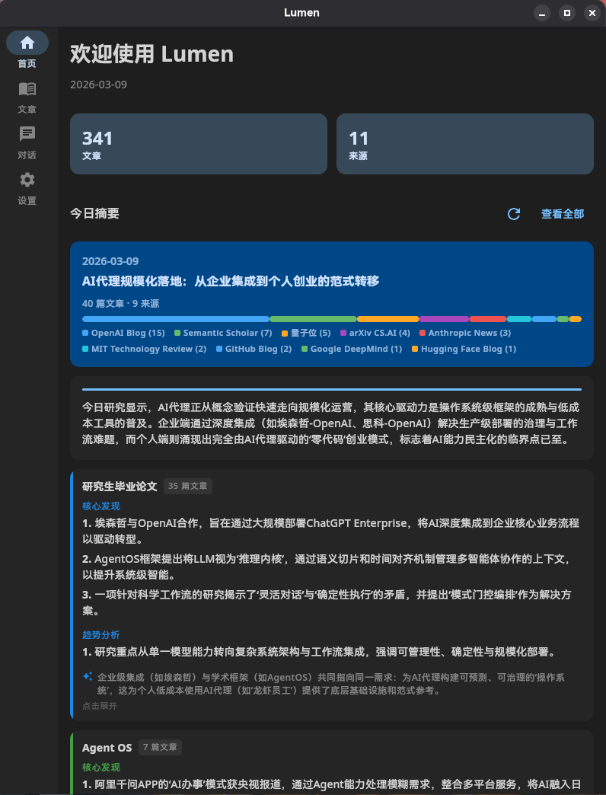
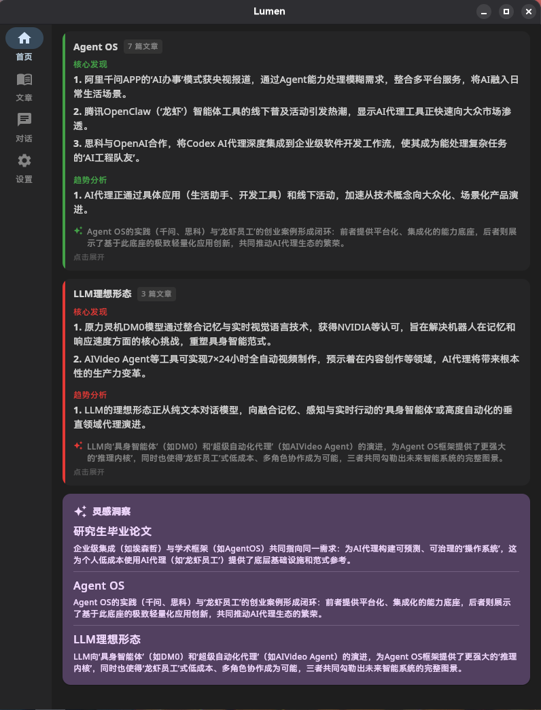
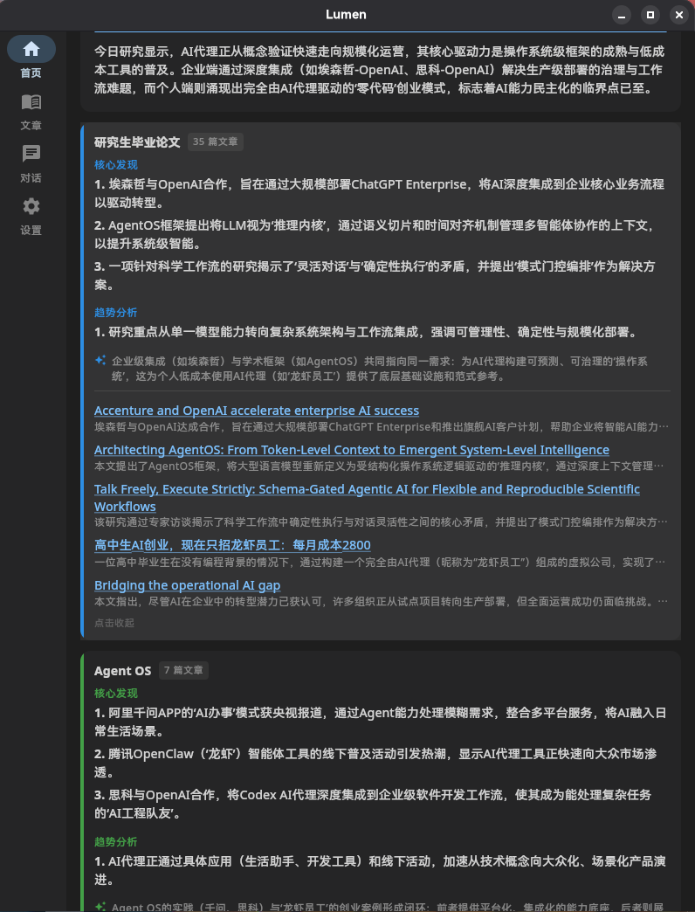
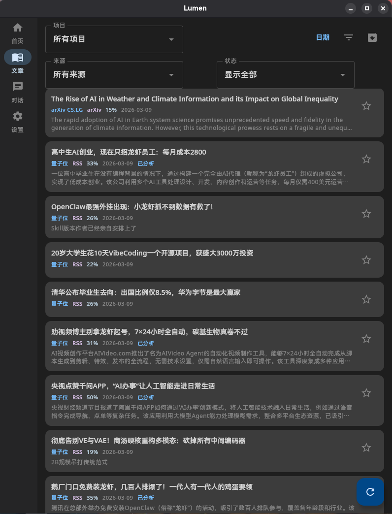
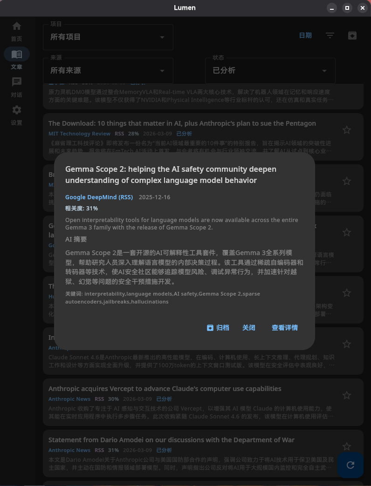
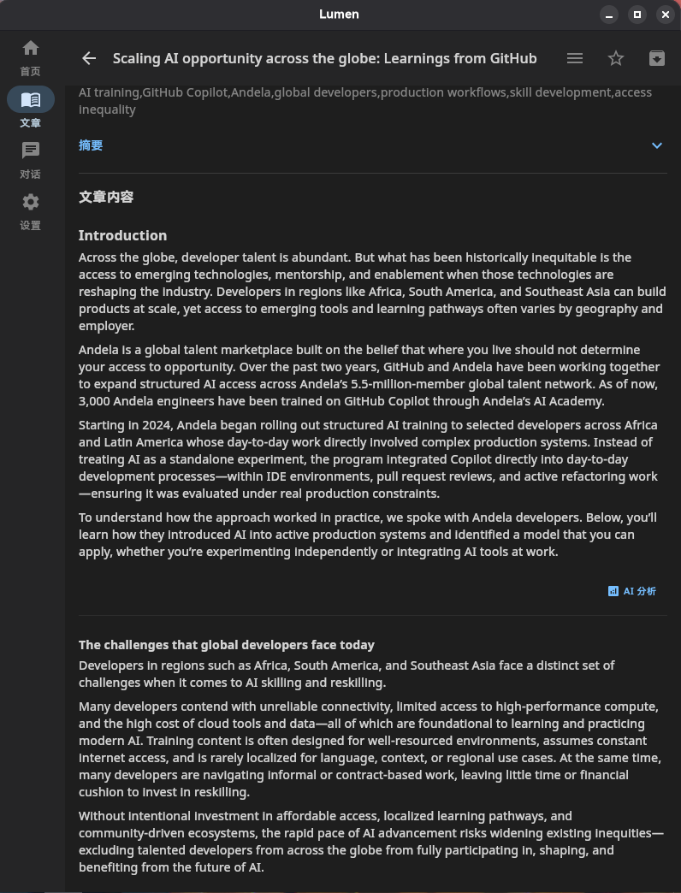
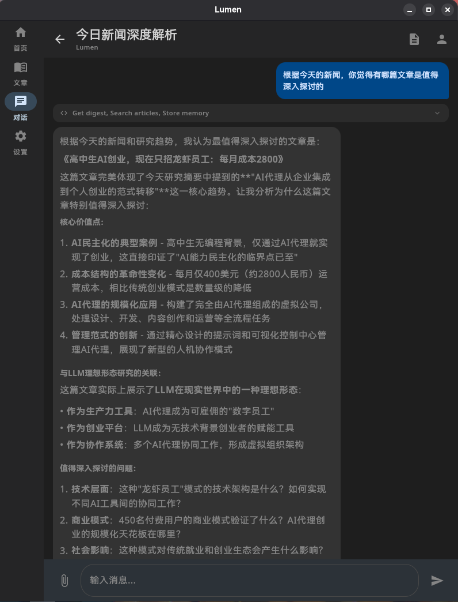
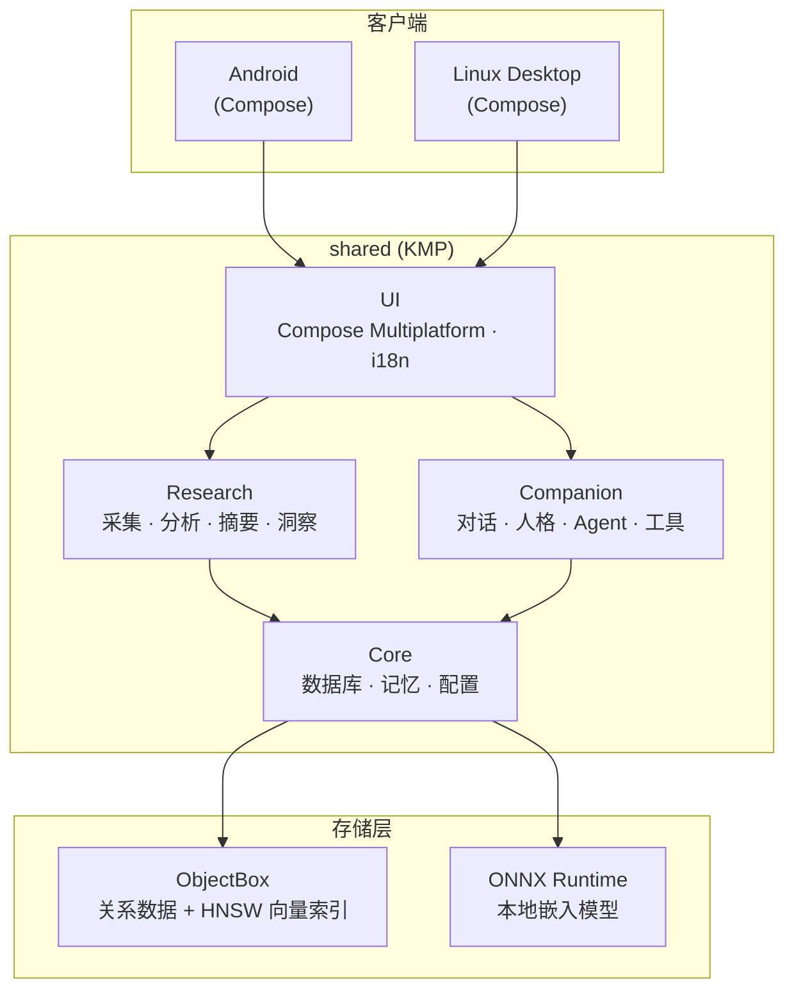
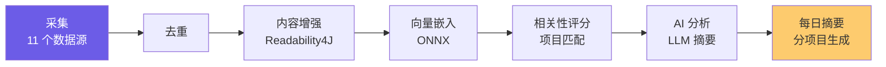

<p align="center">
  
</p>

<h1 align="center">Lumen</h1>

<p align="center">
  <strong>跨平台个人 AI 研究助手与智能伴侣</strong>
</p>

<p align="center">
  <a href="LICENSE"></a>
  
  
  
</p>

<p align="center">
  <a href="README_EN.md">English</a> | 中文
</p>

---

## 简介

**Lumen**（拉丁语，意为"光"）是一款跨平台的个人 AI 智能助手。她以科研辅助为起点，聚合多源学术论文与行业资讯，通过 AI 分析生成每日研究摘要；同时作为长期陪伴的智能伴侣，在持续交互中理解用户、积累记忆、不断成长。

Lumen 坚持**离线优先**与**用户数据自主**——所有数据存储在本地，LLM API Key 由用户自行提供，不依赖任何第三方云服务。

> [!NOTE]
> Lumen 目前处于 **Alpha 阶段**（v0.1.0），核心功能可用但仍在快速迭代中。欢迎参与测试和反馈。

## 功能特性

### 研究助手

- ✅ **多源信息聚合** — 内置 11 个数据源（见下表），支持在「数据源」页面手动添加自定义 RSS 源
- ✅ **AI 智能分析** — 基于 LLM 对文章进行摘要提取、关键词标注与深度解读
- ✅ **向量语义搜索** — 本地 ONNX 嵌入模型 + ObjectBox HNSW 向量索引，毫秒级语义检索
- ✅ **内容增强** — 基于 Readability4J 自动提取文章正文，保留表格与结构
- ✅ **多项目管理** — 自定义研究项目，设定关键词与关注方向，文章自动匹配
- 🔧 **每日研究摘要** — 按用户研究项目自动分类，生成结构化的每日 Digest（项目间文章匹配仍有混淆，修复中）
- 🔧 **跨项目洞察** — Spark 引擎发现不同研究方向之间的潜在关联（依赖项目匹配准确性，待完善）

### 智能伴侣

- ✅ **可定制人格** — 预设多种角色人格与语言风格，支持自定义创建
- ✅ **工具调用** — Agent 可调用 7 种内置工具（文章检索、记忆召回、摘要获取、趋势分析等）
- 🔧 **多轮对话** — 基于 Koog Agent 框架的上下文感知对话，支持流式输出（基础功能可用，尚未充分测试）
- 🔧 **长期记忆** — 基于 SimpleMem 的语义记忆系统，跨会话持久化（基础功能可用，尚未充分测试）
- 🔧 **记忆自动提取** — 对话中自动识别并存储用户偏好、事实、观点等语义信息（基础功能可用，尚未充分测试）
- 🔧 **智能去重** — LLM 驱动的记忆合成与去重（基础功能可用，尚未充分测试）
- 🚧 **上下文联动** — 聊天与项目、每日摘要、文章详情的深度联动（开发中）
- 🚧 **知识图谱** — 结构化知识关联与推理（开发中）
- 📋 **主动推荐** — 基于用户习惯的主动信息推送（规划中）

### 平台与部署

- ✅ **Linux Desktop** — 已测试（Fedora 42）
- ✅ **Android** — APK 构建与发布
- ✅ **离线优先** — 单设备独立运行，无需后端服务
- ✅ **国际化** — 支持中文 / 英文界面切换
- 📋 **Windows Desktop** — 敬请期待
- 📋 **在线模式** — 自部署 Lumen Server，多设备同步与消息桥接（敬请期待）

### 预置数据源

| 数据源 | 类型 | 分类 | 说明 |
|---|---|---|---|
| arXiv CS.AI | arXiv API | 学术 | 人工智能论文 |
| arXiv CS.LG | arXiv API | 学术 | 机器学习论文 |
| Semantic Scholar | API | 学术 | AI/ML 学术论文检索 |
| Hacker News | RSS | 科技 | Hacker News 首页热文 |
| OpenAI Blog | RSS | 科技 | OpenAI 研究与产品动态 |
| GitHub Blog | RSS | 科技 | GitHub 产品公告与功能更新 |
| Anthropic News | RSS | 科技 | Anthropic 新闻与公告 |
| Hugging Face Blog | RSS | 科技 | 开源 AI 模型、数据集与工具 |
| Google DeepMind | RSS | 科技 | Google DeepMind 研究动态 |
| MIT Technology Review | RSS | 科技 | 科技与 AI 行业深度分析 |
| 量子位 | RSS | 科技 | 中文 AI 资讯 |

> 除预置源外，可在「设置 → 数据源」页面手动添加任意 RSS 源。

## 界面预览

<table>
  <tr>
    <td align="center"><strong>首页 — 每日摘要与数据概览</strong></td>
    <td align="center"><strong>首页 — 项目研究摘要</strong></td>
  </tr>
  <tr>
    <td></td>
    <td></td>
  </tr>
  <tr>
    <td align="center"><strong>首页 — 跨项目洞察与趋势</strong></td>
    <td align="center"><strong>文章列表与筛选</strong></td>
  </tr>
  <tr>
    <td></td>
    <td></td>
  </tr>
  <tr>
    <td align="center"><strong>文章 AI 摘要</strong></td>
    <td align="center"><strong>文章全文阅读</strong></td>
  </tr>
  <tr>
    <td></td>
    <td></td>
  </tr>
  <tr>
    <td align="center" colspan="2"><strong>智能对话 — 新闻深度解析</strong></td>
  </tr>
  <tr>
    <td colspan="2" align="center"></td>
  </tr>
</table>

## 快速开始

### 前置要求

- **JDK 17+**
- **任一 LLM API Key**（DeepSeek / OpenAI / Anthropic / OpenAI 兼容端点）

### Linux Desktop 版

> 已在 Fedora 42 上测试通过。

```bash
# 克隆仓库
git clone https://github.com/ydzat/lumen.git
cd lumen

# 运行桌面应用
./gradlew :desktop:run
```

首次启动后在设置页面配置 LLM Provider 和 API Key 即可使用。

### 使用建议

1. **配置 LLM** — 首次启动后，进入「设置」页面配置 LLM Provider 和 API Key
2. **创建项目** — 进入「项目」页面，添加你的研究项目并设定关键词，Lumen 会据此匹配和分类文章
3. **获取文章** — 进入「文章」页面点击刷新，首次采集会从 11 个数据源拉取文章并进行 AI 分析，**耗时较长（约 2-5 分钟），请耐心等待**
4. **查看摘要** — 采集完成后回到「首页」，即可查看按项目分类的每日研究摘要

### Android 版

前往 [Releases](https://github.com/ydzat/lumen/releases) 页面下载最新 APK 安装包。

### Windows 版

> 敬请期待。

### Docker 部署（服务端）

> 敬请期待。

## 支持的 LLM Provider

| Provider | 端点 | 备注 |
|---|---|---|
| DeepSeek | `https://api.deepseek.com` | 推荐，性价比高 |
| OpenAI | `https://api.openai.com` | GPT-4o / GPT-4.1 等 |
| Anthropic | `https://api.anthropic.com` | Claude 系列 |
| 自定义 | 任意 URL | 兼容 OpenAI API 格式的端点（如 One-API） |

## 技术架构



### 数据处理流水线



### 技术选型

| 层级 | 选型 |
|---|---|
| 语言 | [Kotlin Multiplatform](https://kotlinlang.org/docs/multiplatform.html) |
| AI Agent | [Koog](https://github.com/JetBrains/koog)（JetBrains） |
| 数据库 + 向量搜索 | [ObjectBox](https://github.com/objectbox/objectbox-java)（内置 HNSW） |
| 嵌入模型 | [ONNX Runtime](https://onnxruntime.ai/) 本地推理 |
| UI 框架 | [Compose Multiplatform](https://www.jetbrains.com/compose-multiplatform/) |
| 服务端 | [Ktor](https://ktor.io/) |
| 记忆层 | [SimpleMem](https://github.com/aiming-lab/SimpleMem) 移植（Python → Kotlin） |
| 消息桥接 | [LangBot](https://github.com/RockChinQ/LangBot) Bridge Plugin |
| 序列化 | kotlinx-serialization |
| 依赖注入 | Koin |

## 项目结构

```
lumen/
├── shared/              # KMP 共享模块 — 所有核心逻辑与 UI
│   └── src/commonMain/kotlin/com/lumen/
│       ├── core/        # 配置、数据库、记忆、同步
│       ├── research/    # 采集器、分析器、摘要、洞察引擎
│       ├── companion/   # Agent、人格系统
│       └── ui/          # Compose UI、导航、主题、国际化
├── shared-db/           # ObjectBox 实体定义（纯 JVM）
├── android/             # Android 应用入口
├── desktop/             # Desktop 应用入口
├── server/              # Ktor 服务端（在线模式）
├── bridge-plugin/       # LangBot 桥接插件（Python）
└── assets/              # Logo、截图等资源
```

## 运行模式

### 离线模式

安装即用。在设置中输入 API Key，所有数据存储在本地设备。设备间可通过 `.lumen` 存档文件手动迁移数据。

### 在线模式（敬请期待）

自部署 Lumen Server，多台客户端连接同一后端，实现数据实时同步。计划支持：

- **LangBot 消息桥接** — 通过 QQ / Telegram 等平台与 Lumen 交互
- **ntfy 推送通知** — 每日摘要生成后自动推送提醒

## 演进路线

| 阶段 | 说明 | 状态 |
|---|---|---|
| 1. 研究助理 | 多源采集、AI 摘要、内容增强、语义搜索、多项目管理 | ✅ 已完成 |
| ↳ 摘要与洞察 | 每日 Digest 项目分类、Spark 跨项目洞察 | 🔧 基本可用，修复中 |
| 2. 智能伴侣 | 角色人格、7 种工具调用 | ✅ 已完成 |
| ↳ 对话与记忆 | 多轮对话、记忆提取与去重、上下文联动 | 🔧 基本可用，测试中 |
| 3. 长期记忆 | SimpleMem 语义记忆、LLM 记忆合成、意图分解检索 | 🔧 基本可用，测试中 |
| ↳ 知识图谱 | 结构化知识关联与推理 | 🚧 开发中 |
| 4. 自主 Agent | 主动推荐、独立任务执行、工作流自动化 | 📋 规划中 |
| 5. 多模态 | 语音交互、图像理解 | 📋 规划中 |

## 参与贡献

欢迎提交 Issue 和 Pull Request。请参考以下规范：

- 分支从 `develop` 创建，PR 目标为 `develop`
- Commit 消息遵循 [Conventional Commits](https://www.conventionalcommits.org/) 规范
- 代码风格遵循 [Kotlin 编码约定](https://kotlinlang.org/docs/coding-conventions.html)
- Issue 和 PR 请使用仓库提供的模板

## 许可证

本项目基于 [AGPL-3.0](LICENSE) 许可证开源。

Copyright &copy; 2025 ydzat
