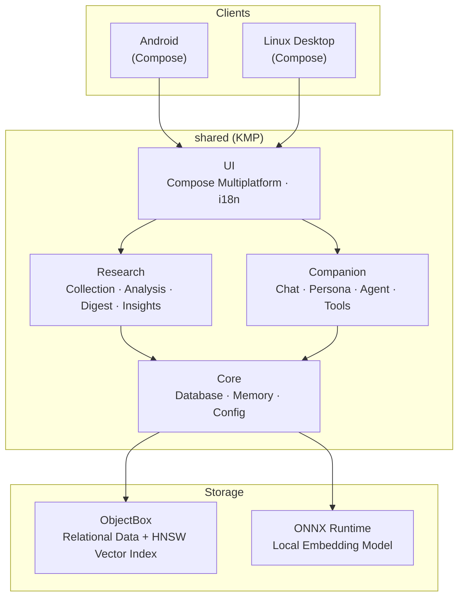
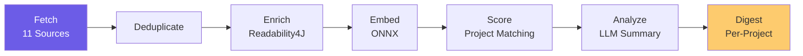

<p align="center">
  
</p>

<h1 align="center">Lumen</h1>

<p align="center">
  <strong>Cross-Platform Personal AI Research Assistant & Intelligent Companion</strong>
</p>

<p align="center">
  <a href="LICENSE"></a>
  
  
  
</p>

<p align="center">
  English | <a href="README.md">中文</a>
</p>

---

## Introduction

**Lumen** (Latin for "light") is a cross-platform personal AI assistant. Starting as a research aide, it aggregates academic papers and industry news from multiple sources, generating daily research digests through AI analysis. It also serves as a long-term intelligent companion that understands you, accumulates memory, and grows through continuous interaction.

Lumen is committed to an **offline-first** and **user-owned data** philosophy — all data is stored locally, LLM API keys are provided by the user, and no third-party cloud services are required.

> [!NOTE]
> Lumen is currently in **Alpha** (v0.1.0). Core features are functional but still under rapid iteration. Feedback and testing are welcome.

## Features

### Research Assistant

- ✅ **Multi-Source Aggregation** — 11 built-in data sources (see table below), with support for adding custom RSS feeds via the Sources page
- ✅ **AI-Powered Analysis** — LLM-based article summarization, keyword extraction, and in-depth analysis
- ✅ **Vector Semantic Search** — Local ONNX embedding model + ObjectBox HNSW vector index for millisecond-level semantic retrieval
- ✅ **Content Enrichment** — Automatic full-text extraction via Readability4J, preserving tables and document structure
- ✅ **Multi-Project Management** — Create research projects with custom keywords and focus areas; articles are automatically matched
- 🔧 **Daily Research Digest** — Auto-categorized by user projects into structured daily digests (cross-project article matching still has issues, fix in progress)
- 🔧 **Cross-Project Insights** — Spark engine discovers potential connections between different research directions (depends on project matching accuracy, being refined)

### Intelligent Companion

- ✅ **Customizable Persona** — Multiple built-in personas with configurable language style, plus custom persona creation
- ✅ **Tool Calling** — Agent can invoke 7 built-in tools (article search, memory recall, digest retrieval, trend analysis, etc.)
- 🔧 **Multi-Turn Chat** — Context-aware conversation with streaming output via Koog Agent framework (functional, not yet fully tested)
- 🔧 **Long-Term Memory** — SimpleMem-based semantic memory system with cross-session persistence (functional, not yet fully tested)
- 🔧 **Auto Memory Extraction** — Automatically identifies and stores user preferences, facts, and opinions from conversations (functional, not yet fully tested)
- 🔧 **Smart Deduplication** — LLM-driven memory synthesis and deduplication (functional, not yet fully tested)
- 🚧 **Context Integration** — Deep linking between chat, projects, daily digests, and article details (in development)
- 🚧 **Knowledge Graph** — Structured knowledge association and reasoning (in development)
- 📋 **Proactive Recommendations** — Habit-based proactive information push (planned)

### Platform & Deployment

- ✅ **Linux Desktop** — Tested on Fedora 42
- ✅ **Android** — APK build and release
- ✅ **Offline-First** — Fully standalone on a single device, no backend required
- ✅ **Internationalization** — Chinese / English UI switching
- 📋 **Windows Desktop** — Coming soon
- 📋 **Online Mode** — Self-hosted Lumen Server for multi-device sync and messaging bridge (coming soon)

### Built-in Data Sources

| Source | Type | Category | Description |
|---|---|---|---|
| arXiv CS.AI | arXiv API | Academic | Artificial Intelligence papers |
| arXiv CS.LG | arXiv API | Academic | Machine Learning papers |
| Semantic Scholar | API | Academic | AI/ML research paper search |
| Hacker News | RSS | Tech | Hacker News front page |
| OpenAI Blog | RSS | Tech | OpenAI research and product updates |
| GitHub Blog | RSS | Tech | GitHub product announcements and features |
| Anthropic News | RSS | Tech | Anthropic news and announcements |
| Hugging Face Blog | RSS | Tech | Open-source AI models, datasets, and tools |
| Google DeepMind | RSS | Tech | Google DeepMind research updates |
| MIT Technology Review | RSS | Tech | Technology and AI industry analysis |
| QbitAI (量子位) | RSS | Tech | Chinese AI news |

> In addition to built-in sources, you can add any RSS feed via Settings > Sources.

## Screenshots

<table>
  <tr>
    <td align="center"><strong>Home — Daily Digest & Overview</strong></td>
    <td align="center"><strong>Home — Project Research Digest</strong></td>
  </tr>
  <tr>
    <td></td>
    <td></td>
  </tr>
  <tr>
    <td align="center"><strong>Home — Cross-Project Insights</strong></td>
    <td align="center"><strong>Article List & Filters</strong></td>
  </tr>
  <tr>
    <td></td>
    <td></td>
  </tr>
  <tr>
    <td align="center"><strong>Article AI Summary</strong></td>
    <td align="center"><strong>Full Article View</strong></td>
  </tr>
  <tr>
    <td></td>
    <td></td>
  </tr>
  <tr>
    <td align="center" colspan="2"><strong>AI Chat — In-Depth News Analysis</strong></td>
  </tr>
  <tr>
    <td colspan="2" align="center"></td>
  </tr>
</table>

## Getting Started

### Prerequisites

- **JDK 17+**
- **An LLM API Key** (DeepSeek / OpenAI / Anthropic / any OpenAI-compatible endpoint)

### Linux Desktop

> Tested on Fedora 42.

```bash
# Clone the repository
git clone https://github.com/ydzat/lumen.git
cd lumen

# Run the desktop app
./gradlew :desktop:run
```

Configure your LLM provider and API key in the Settings page on first launch.

### Usage Guide

1. **Configure LLM** — On first launch, go to Settings and configure your LLM provider and API key
2. **Create Projects** — Go to the Projects page, add your research projects with keywords so Lumen can match and categorize articles accordingly
3. **Fetch Articles** — Go to the Articles page and tap refresh. The initial fetch pulls from all 11 data sources and runs AI analysis — **this may take 2-5 minutes, please be patient**
4. **View Digest** — Once fetching is complete, return to the Home page to see your project-categorized daily research digest

### Android

Download the latest APK from the [Releases](https://github.com/ydzat/lumen/releases) page.

### Windows

> Coming soon.

### Docker Deployment (Server)

> Coming soon.

## Supported LLM Providers

| Provider | Endpoint | Notes |
|---|---|---|
| DeepSeek | `https://api.deepseek.com` | Recommended, cost-effective |
| OpenAI | `https://api.openai.com` | GPT-4o / GPT-4.1, etc. |
| Anthropic | `https://api.anthropic.com` | Claude series |
| Custom | Any URL | Any OpenAI-compatible endpoint (e.g., One-API) |

## Architecture



### Data Processing Pipeline



### Tech Stack

| Layer | Choice |
|---|---|
| Language | [Kotlin Multiplatform](https://kotlinlang.org/docs/multiplatform.html) |
| AI Agent | [Koog](https://github.com/JetBrains/koog) (JetBrains) |
| DB + Vector Search | [ObjectBox](https://github.com/objectbox/objectbox-java) (built-in HNSW) |
| Embedding Model | [ONNX Runtime](https://onnxruntime.ai/) local inference |
| UI Framework | [Compose Multiplatform](https://www.jetbrains.com/compose-multiplatform/) |
| Server | [Ktor](https://ktor.io/) |
| Memory | [SimpleMem](https://github.com/aiming-lab/SimpleMem) port (Python → Kotlin) |
| Messaging Bridge | [LangBot](https://github.com/RockChinQ/LangBot) Bridge Plugin |
| Serialization | kotlinx-serialization |
| DI | Koin |

## Project Structure

```
lumen/
├── shared/              # KMP shared module — all core logic & UI
│   └── src/commonMain/kotlin/com/lumen/
│       ├── core/        # Config, database, memory, sync
│       ├── research/    # Collector, analyzer, digest, insights engine
│       ├── companion/   # Agent, persona system
│       └── ui/          # Compose UI, navigation, theme, i18n
├── shared-db/           # ObjectBox entity definitions (pure JVM)
├── android/             # Android app entry point
├── desktop/             # Desktop app entry point
├── server/              # Ktor server (online mode)
├── bridge-plugin/       # LangBot bridge plugin (Python)
└── assets/              # Logo, screenshots, and other assets
```

## Modes

### Offline Mode

Install and run. Enter your API key in Settings, and all data is stored locally on your device. Migrate between devices via `.lumen` archive files.

### Online Mode (Coming Soon)

Self-host Lumen Server for multi-device real-time sync. Planned features:

- **LangBot Messaging Bridge** — Interact with Lumen via QQ / Telegram and other platforms
- **ntfy Push Notifications** — Automatic push alerts when daily digests are generated

## Roadmap

| Phase | Description | Status |
|---|---|---|
| 1. Research Aide | Multi-source collection, AI summarization, content enrichment, semantic search, multi-project management | ✅ Done |
| ↳ Digest & Insights | Daily digest project categorization, Spark cross-project insights | 🔧 Functional, fixes in progress |
| 2. Intelligent Companion | Persona system, 7 built-in tools | ✅ Done |
| ↳ Chat & Memory | Multi-turn chat, memory extraction & deduplication, context integration | 🔧 Functional, under testing |
| 3. Long-Term Memory | SimpleMem semantic memory, LLM memory synthesis, intent-based retrieval | 🔧 Functional, under testing |
| ↳ Knowledge Graph | Structured knowledge association and reasoning | 🚧 In development |
| 4. Autonomous Agent | Proactive recommendations, autonomous task execution, workflow automation | 📋 Planned |
| 5. Multimodal | Voice interaction, image understanding | 📋 Planned |

## Contributing

Issues and Pull Requests are welcome. Please follow these guidelines:

- Branch from `develop`; PRs should target `develop`
- Commit messages follow [Conventional Commits](https://www.conventionalcommits.org/)
- Code style follows [Kotlin coding conventions](https://kotlinlang.org/docs/coding-conventions.html)
- Please use the issue and PR templates provided in the repository

## Sponsor

If Lumen is helpful to you, consider supporting the project:

<p align="center">
  <a href="https://ko-fi.com/ydzat">
    
  </a>
  &nbsp;&nbsp;
  <a href="https://afdian.com/a/ydzat">
    
  </a>
</p>

- **International**: Support via [Ko-fi](https://ko-fi.com/ydzat) (PayPal / Credit Card)
- **China**: Support via [Afdian](https://afdian.com/a/ydzat) (WeChat Pay / Alipay)

## License

This project is licensed under [AGPL-3.0](LICENSE).

Copyright &copy; 2025 ydzat
